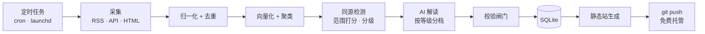

<!-- 给 Claude Code 的说明：本文件是产品与技术方案的最终确认版。开发时以此为准。
第一个任务：按「分阶段计划」做第 0 步——挑一个真实事件，不写代码，手工产出一张事件卡；然后再做第 1 版。 -->

# 资讯聚合与 AI 解读站 · 产品与技术文档

2026-09-17 · 最终确认版（由 Cowork 会话导出）

> 第一版形态：**私人 web 站**，只给自己和朋友看。范围：投资 / 金融经济 / 相关政策，中英文信源并重，信源全部公开免费。

## 这是什么

一个只给自己和朋友用的资讯站：自动抓三四十个公开免费信源（媒体、智库、官方、企业），把同一件事的多家报道合成一张卡，按影响范围分级，给重要的事配 AI 解读，每条结论都能点回原文。首页展示当天所有过了 C 级门槛的事件，条数由当天决定，没有上限。

### 做什么，不做什么

| 做 | 不做 |
| --- | --- |
| 抓公开源、跨源聚类成事件 | 原创报道与新闻评论 |
| 标题 + 要点摘要 + 原文链接 | 转载正文全文 |
| 有据可依的影响分析 | 投资建议、买卖信号 |
| 每条结论标来源与模型 | 注册、付费、社区、评论区 |

### 「私人站」改变了什么

这是第一版最重要的前提，它砍掉了大量负担：

|  | 公开产品 | 私人站 |
| --- | --- | --- |
| 资质 | 涉及互联网新闻信息服务许可 | 不面向公众提供，不适用 |
| 用户系统 | 注册、权限、付费 | 一个访问控制就够 |
| 增长 | 获客、留存、日活 | 不需要 |
| 运营 | A+ 人工确认、复核队列 | 自己顺手看 |
| 版权 | 公开传播风险高 | 小范围仍需克制，但风险小一个量级 |

但有三条不因为是私人站就放松，它们既是产品质量本身，也是为将来留余地：

1. **不落库正文**，只存标题、摘要、URL 和引用位置
2. **AI 生成内容明确标注**模型名与生成时间
3. **严守 robots.txt 与抓取频率**

### 给谁用

我自己和几个朋友。共同特征：每天要扫十几个源、英文无障碍、时间稀缺，最大的焦虑是「我是不是漏了什么」。

不需要猜测用户画像——用户就是我们自己。这是私人站最大的好处：需求验证是即时的，不好用自己第一个知道。

## 页面与交互

三个页面就够：今日流、事件卡、归档搜索。

### 首页两栏

| 栏位 | 内容 | 排序 |
| --- | --- | --- |
| 被低估 | 范围分高、媒体覆盖度低的事件 | 落差从大到小 |
| 今日其余 | 其余入选事件 | 范围分从高到低 |

「被低估」是每天打开的理由——最热的三条到处都能看到，落差最大的三条只有这里有。

没有每日条数上限：过了 C 级门槛的全部展示，一天 3 条或 100 条都正常。页底固定一条「今日未达 C 级 N 条（仅标题）」，可展开。**被淘汰的事件折叠而不是删除**：会偷偷丢新闻的工具正好击中「怕漏」这个焦虑。

### 事件卡结构（从上到下）

1. 可信度标 + 等级标（A+ / A / B / C）+ 低估标（有才显示）
2. 中性标题——系统生成，不照搬任何一家
3. 影响范围条——人口、行业数、经济规模、持续时间四个数
4. 信源条——所有独立报道并排，转载折叠为「另有 N 家转载」
5. 一句话事实
6. AI 解读区块（带署名头）
7. 每条结论行尾的溯源角标

### 展示规则

| 元素 | 规则 |
| --- | --- |
| 可信度标 | 「已确认」不显眼；「未经官方确认」黄色；「来源存疑」红色且置顶 |
| 存疑卡片 | 不显示影响分析，改显示「为何存疑」 |
| 等级标 | A+ 与 A 强色块，B 细边框，C 只标字母 |
| 影响范围条 | 四个数并排，持续时间必须标明是估计值 |
| 信源标注 | 独立报道始终可见，永不折叠；转载单独收起计数 |
| 信源排序 | L1 官方优先，组内按发布时间 |
| 摘要 | 不超 100 字，末尾必为原文链接 |
| AI 区块 | 独立底色与边框，与事实区视觉上明确分离 |
| 结论角标 | 悬停显示原文片段，点击跳转并高亮 |
| 证据等级 | 每条结论尾部标 E1 / E2，E2 可展开公式 |
| 无解读时 | 明确显示「暂无解读」，不用模型硬凑 |
| 英文标题 | 保留原文，下方附中文译名并标注机器翻译 |
| C 级卡片 | 默认收起解读区只显一句话事实，展开可见完整四段解读 |

### 归档搜索

按时间、等级、event\_type、信源筛选，全文搜标题与摘要。私人站不需要推荐算法，但需要能找回三个月前那条。

### 三条不妥协的原则

- **AI 区与事实区必须视觉隔离。** 一眼能分清哪些是原文事实、哪些是机器写的。
- **信源永不折叠进「更多」。** 它是主体信息，不是元数据。
- **不可溯源的结论不上线。** 宁可卡片短一点。

## 内容规则

### 分级是为了分配资源

分级的产物是「这条值得花多少算力」，不是「这条有多重要」这个结论本身。所以不需要 100% 准确。

| 等级 | 稀有程度（量级参考） | 模型 | 上下文 | 输出 |
| --- | --- | --- | --- | --- |
| A+ | 十年数次 | Fable 5.1（第 3 版起加第二家对抗） | 全量 | 完整解读（第 3 版起双模型并排） |
| A | 一年数次到十余次 | Fable 5.1 | + 结构性数据 | 完整解读 |
| B | 每周数条 | 顶级 Opus 5 | + 上一版文件 | 完整解读 |
| C | 约每小时一条 | 次顶级 Sonnet 5 | 本事件段落 | 完整解读 |

稀有程度那列是**量级参考，不是配额**。百年一遇的洪水可以一年出现三次——重现期讲的是量级，不是日程。所以阈值是绝对的，用历史上公认的大事一次性标定，之后固定：平静的年份可能一个 A+ 都没有，C 级也一样——「约每小时一条」是发生率，不是每日配额，一天出 1 条或 100 条都不需要干预。

**阈值故意偏低。** 误判代价不对称：C 误判为 A 浪费几美元，A 误判为 C 漏掉一次重要解读。同理，等级每两小时重算，**只升不降**。

分级错了能补救的前提是：**所有事件的原始数据全存**，不管等级多低。只有解读深度按等级分配。存储几乎免费，事后重算解读也就几美分；当时没存的补不回来。

### 影响力 = 影响范围

分数不看有多少人在谈论，看影响到什么范围：

| 维度 | 含义 | 来源 |
| --- | --- | --- |
| 人口范围 | 直接受影响人数 | 世界银行、统计局、行业从业人数 |
| 行业广度 | 波及几个行业 | 行业分类映射 |
| 经济规模 | 金额、占 GDP 比重 | FRED、Comtrade、EDGAR |
| 持续时间 | 影响的时间尺度 | 政策有效期，或同类事件存续中位数 |

合成：`score = log(人口) + log(时长) + log(行业数) + log(经济规模)`

**持续时间是乘数不是加数。** 影响一千万人两周和影响一千万人二十年，差的是量级不是程度。它同时是估计值，展示时必须标明。

每个 event\_type 配一个范围解析器。第 1–2 版只做三个（央行利率调整、关键经济数据发布、公司财报），其余走默认保守估计。

要认一个矛盾：第 1–2 版没有先例库，持续时间只能用政策有效期或保守默认值，结构性事件一律拿到「未知」——而它们恰恰最可能被低估。第 3 版的先例库补这个缺口；在那之前，「被低估」栏对结构性事件会漏。

### 覆盖度落差

媒体覆盖度不用来判断重要性，用来算落差：

| 情形 | 含义 |
| --- | --- |
| 覆盖度高、范围分低 | 被过度关注 |
| 覆盖度低、范围分高 | **被严重低估** |

**同源检测是前提。** 二十家转同一篇稿看起来像二十个独立信源。用正文 SimHash + 首报时间聚集 + 署名转载三重判定，去掉转载后剩下的才是独立报道数。没有它，分级会被转载量最大的稿子骗走。

### 可信度评估：不分等级，全部要做

C 级是假新闻照样有害，而且假消息往往一开始就是低覆盖的。降级的只是解读深度，不是事实核查。

| 信号 | 方向 |
| --- | --- |
| L1 官方源已确认 | 强正 |
| 独立报道数（去转载后） | 正 |
| 可追溯到具名一手来源 | 正 |
| 转述链含「据知情人士」且无法上溯 | 强负 |
| 相关方已公开否认 | 强负 |

输出三档：已确认 / 多方报道但未经官方确认 / 来源存疑。存疑的卡片不生成影响分析——对一条可能是假的消息分析影响，本身就是在传播它。

### 解读的固定结构

不让模型自由发挥。四段：

1. **发生了什么** —— 一句话事实
2. **变了什么** —— 相比上一版改了哪里，条文级 diff
3. **量级锚定** —— 这个数字算大吗：占比、倍数、历史分位
4. **各源差异** —— 有才显示，没有就明说各源一致

「变了什么」是最硬的功能。政策文件的信息量藏在改动里，而不是内容本身；这件事完全客观、可溯源、人工做极其枯燥、AI 做很准。

### 两级证据

| 等级 | 含义 | 展示 |
| --- | --- | --- |
| E1 直接数据 | 结论直接来自原文或官方数据 | 实线角标 |
| E2 计算推导 | 由 E1 经明确公式算出 | 实线 + 可展开公式 |

**第一版没有第三级。** 历史类比（E3）需要先例库，放在第二阶段。推不出来就不输出。

### AI 只做可锚定的判断

有客观依据可查的对比、量级、差异都做；纯预测和纯意见不做。不是胆小，是模型做不好而且错一次信誉就没了。

**2026-09-18 修订：** 只出事实的卡片没有回答「所以呢」，价值不足。第 1 版就加两段推演——**连锁反应**（传导链条：谁、方向、时滞）与**演化路径**（2—4 条互斥走向，每条带触发条件、观察指标、时间窗、证伪信号），从原就规划在第 3 版提前到现在。推演与事实在页面上分区、单独标注 R，并受硬约束：出发点必须引用原文，正文数字必须有出处（自设阈值只能进「触发条件」字段），写不出证伪信号的不上线，出现买卖动作或价位目标的整条丢弃。历史类比（E3）仍等先例库。

## 信源清单

官方文件只是一层。新闻的主体来自媒体、智库、研究机构和企业，信源按「它是什么」分七类。首版目标 30–40 个源，全部公开免费；其中九成是 RSS 或 API，几乎不需要维护——「只接十个」那条约束只对 HTML 抓取器成立，不对 RSS 成立。

### 一、官方与法定披露（事件的原始出处）

| 中文 | 英文 |
| --- | --- |
| [国务院政策文件库](https://www.gov.cn/zhengce/zhengcewenjianku/)、央行、[证监会](https://www.csrc.gov.cn/)、财政部、发改委、[统计局](https://www.stats.gov.cn/wzgl/rss/)、[巨潮](https://www.cninfo.com.cn/new/index.jsp)、上深交所 | [SEC EDGAR](https://www.sec.gov/search-filings/edgar-application-programming-interfaces)、美联储 FOMC、美国财政部、BLS / BEA、[FRED](https://fred.stlouisfed.org/docs/api/fred/) |

全文可展示，同时是证据源。但它们是**事件本身**，不是对事件的报道——只靠这一层既没有社会新闻，也测不出覆盖度。

### 二、通讯社与综合大报（社会全景）

| 信源 | 语言 | 获取 |
| --- | --- | --- |
| 人民网 / 人民日报 | 中 | 官方 RSS |
| 新华网、央视新闻 | 中 | RSSHub |
| 澎湃新闻 | 中 | RSSHub |
| 界面新闻 | 中 | 官方 RSS |
| 联合早报 | 中 | RSSHub |
| BBC 中文、FT 中文网、日经中文网 | 中 | RSSHub |
| BBC、The Guardian、NYT | 英 | 官方 RSS |
| Al Jazeera、Nikkei Asia | 英 | 官方 RSS |
| Reuters、AP | 英 | 无稳定公开 RSS；覆盖度靠 GDELT 补，正文靠其他媒体转述 |

### 三、财经专业媒体

| 信源 | 语言 | 获取 |
| --- | --- | --- |
| 第一财经、[经济观察网](https://www.eeo.com.cn/sypd/rss/index.html)、和讯 | 中 | 官方 RSS |
| 21 世纪经济报道、证券时报、中国证券报、上海证券报 | 中 | RSSHub 或抓取 |
| 华尔街见闻 | 中 | RSSHub |
| [财联社电报](https://www.cls.cn/) | 中 | 抓取，有反爬，第 2 版 |
| 财新 | 中 | 付费墙，仅标题 + 链接 |
| FT、WSJ、CNBC、MarketWatch、The Economist | 英 | 官方 RSS（标题 + 摘要） |
| Bloomberg | 英 | 无公开 RSS，仅标题 |

### 四、智库与研究机构（解读的参照系）

| 信源 | 语言 | 获取 |
| --- | --- | --- |
| Brookings、PIIE、CFR、CSIS、Carnegie、Chatham House | 英 | 官方 RSS |
| IMF 博客、世界银行博客、BIS | 英 | 官方 RSS |
| 中国宏观经济论坛、CF40、国务院发展研究中心、社科院 | 中 | RSSHub 或抓取 |

免费、质量高、常被媒体引用。这一类对「变了什么、意味着什么」最有用，也是第 3 版先例库和类比库的主要来源。

### 五、学术工作论文

NBER、SSRN、arXiv（econ / q-fin）——官方 RSS。低频但硬，只接宏观与金融分类。

### 六、企业与行业

PR Newswire 与 Business Wire（企业新闻稿，官方 RSS）、重要公司 IR 页面、行业协会（中汽协、中钢协等）。只对关注的公司和行业接，不铺开。

### 七、聚合与关注度信号

| 信源 | 用途 |
| --- | --- |
| [GDELT DOC 2.0](https://blog.gdeltproject.org/gdelt-doc-2-0-api-debuts/) | **覆盖度测量的主信号**——全球 65 语种媒体报道量，落差计算靠它 |
| 微博热搜、知乎热榜 | 国内关注度信号，只做信号不做内容 |

GDELT 从「发现层」升为「覆盖度源」：它本身就是全球媒体报道计数，比自己数 RSS 里有几家报了准得多。

### 获取方式决定维护成本

| 方式 | 维护 | 典型 |
| --- | --- | --- |
| 官方 RSS | 几乎零 | BBC、FT、WSJ、人民网、第一财经、界面、智库 |
| 官方 API | 零 | EDGAR、FRED、GDELT |
| RSSHub（本地自建） | 低，路由偶尔失效 | 澎湃、新华网、央视、联合早报、华尔街见闻 |
| HTML 抓取 | 高，每季度修 | 中文官方栏目页、财联社 |

**RSSHub 是关键。** 开源项目，把上百个没有 RSS 的中文站点变成 RSS，可以在本地和流水线一起跑。它把大部分中文媒体从「高维护抓取」变成「低维护 RSS」。路由会变，接之前本地跑一遍确认。

HTML 抓取器控制在 5 个以内。这才是真正的维护上限。

### 各类源在流水线里的角色

| 类 | 角色 | 展示 |
| --- | --- | --- |
| 一 | 事件原始出处 + 证据源 | 全文 |
| 二、三 | 覆盖度、多源对比、可信度判定 | 标题 + 不超 100 字摘要 + 链接 |
| 四、五 | 解读时的参照系（量级、先例、机制） | 引用 + 链接 |
| 六 | 公司事件的原始出处 | 新闻稿可全文，IR 公告可全文 |
| 七 | 落差计算的覆盖度信号 | 不展示内容 |

### 展示边界

| 内容类型 | 可展示程度 | 依据 |
| --- | --- | --- |
| 政策原文、法规、国家机关文件 | 全文 | [著作权法第五条](https://www.ncac.gov.cn/xxfb/flfg/flfg_532/202103/t20210309_50530.html) |
| 法定披露、企业新闻稿 | 全文 | 公开披露 / 主动发布 |
| 官方统计数据 | 全量 | 第五条 + 数据本身非作品 |
| 媒体报道、智库文章 | 标题 + 不超 100 字摘要 + 链接 | 无授权时的保守边界 |

工程上的做法：对二至五类只存标题、发布时间、URL 和聚类向量，不落库正文。解读在内存中读完正文后即丢弃，只保留引用位置。

## 系统架构

一条本地流水线，每天定时跑一次，产出静态 HTML 推到免费托管。**没有服务器，没有后端 API，没有运维。**

### 为什么本地跑

|  | 云服务器 | 本地电脑 |
| --- | --- | --- |
| 成本 | 40–80 美元/月 | 0 |
| 抓取 IP | 数据中心 IP，容易被反爬拦 | 住宅 IP，风险低得多 |
| 运维 | 要管 | 不用管 |
| 可用性 | 24/7 | 关机就不跑 |

最后一行是唯一的代价，而且不要紧：抓的是 RSS 和 API，都有历史，开机后补抓即可。这正是「不要求实时」带来的好处。

云端跑也能跑，但对这个场景不划算：数据中心 IP 抓中文官方站点容易被限，而且生成的静态文件还要想办法推出去。

### 一次运行做什么

1. 抓取各源自上次运行以来的新内容
2. 正文提取、归一化、去重（URL 规范化 + SimHash）
3. 向量化，48 小时窗口内全量重聚类
4. 同源检测 → 独立报道数 → 范围打分 → 分级
5. 按等级调模型生成解读 → 校验闸门 → 落库
6. 生成静态 HTML
7. `git commit && git push`

单次运行预计几分钟，主要时间花在等模型返回。

### 批处理而非流式

不要求实时让很多东西变简单：聚类不用做增量（当日文档全量重聚就行，数据量小），排序不用滚动（日终定稿比实时排序准得多），抓取不用持续轮询（每天一两次，反爬风险也更小）。

### 静态站为什么够用

这个产品所有的交互都是**读**：看卡片、悬停看原文片段、点击跳转、搜索归档。没有一个需要写。数据在生成时全部物化进页面，前端 JS 完成交互，不需要任何后端。

一年约 9000 条事件的规模，全量重建也就几秒到几十秒。

## 数据模型

本地 SQLite 一个文件搞定。几千条向量用 numpy 暴力算相似度就够，毫秒级，不需要 pgvector，也不需要跑数据库服务。

### 核心表

| 表 | 关键字段 | 说明 |
| --- | --- | --- |
| `source` | tier, lang, fetch\_method, display\_policy | 信源注册表，决定每个源能展示到什么程度 |
| `document` | source\_id, url, title, published\_at, simhash, body\_stored | 单篇；L2 的 body\_stored 恒为 false |
| `passage` | document\_id, ordinal, text, embedding | 只对 L1 存文本，L2 只存偏移量 |
| `event` | first\_seen, canonical\_title, grade, graded\_at, credibility\_tier | 一个事件一行 |
| `event_scope` | population, industries, econ\_scale, duration\_months, duration\_is\_estimate | 影响范围四维度，分数由此算出 |
| `event_member` | event\_id, document\_id, similarity, is\_reprint | 多对多；is\_reprint 标记同源转载 |
| `interpretation` | event\_id, model\_name, model\_version, prompt\_version, generated\_at | 一次解读一行 |
| `claim` | interpretation\_id, ordinal, text, evidence\_level | E1 / E2 |
| `citation` | claim\_id, passage\_id, char\_range, quote\_hash | 论断 ↔ 出处，多对多 |

### 溯源怎么落地

不能指望模型自己乖乖输出引用。三步：

1. 输入是**带编号的段落列表**，每段一个 ID
2. 输出必须是结构化 JSON，每条 claim 带 `passages` 数组和 `evidence` 等级
3. 生成后逐条校验（蕴含性 + 数字逐字回填），不过关直接丢弃而不是降级展示

丢弃率是最灵敏的监控指标：突然上升通常意味着上游源改了页面结构导致正文提取出错。

### 静态站需要物化视图

静态 HTML 没有后端查询，所以生成时要把页面需要的一切物化进去：

- 每张事件卡的 JSON（含所有 claim、citation、原文片段）内嵌在页面里
- 悬停显示原文片段、点击跳转高亮，全部前端 JS 完成，不需要 API
- 归档搜索用一个预生成的索引文件，几千条的规模客户端全文搜索完全够

这反而比有后端简单。

### 备份

SQLite 文件同步到一个私有 git 仓库或网盘。原始数据全存是分级可纠错的前提——库丢了，几个月的历史就没了，而且补不回来。

## AI 调用与成本

### 用 Claude Code 还是用 API

两个都用，但分工不同：

| 用途 | 工具 | 理由 |
| --- | --- | --- |
| 流水线里的解读生成 | API | 要 schema 约束、温度 0、可复现、按等级选不同档位模型 |
| 写抓取器、修失效的解析器、生成站点模板 | Claude Code | 它最强的地方，而且是这个项目最耗人的部分 |

**第二行比第一行值钱。** 这个项目最大的持续成本是源维护——HTML 抓取器每季度因页面改版静默失效。让 Claude Code 干这个：检测到解析失败 → 读新的页面结构 → 改解析代码 → 跑测试 → 通过就提交。

**前提是每个抓取器有 golden file。** 存几个历史页面快照和对应的期望解析结果，修完跑一遍，字段齐、值对得上才算通过。没有这个，「自动修复」就是让 AI 自由发挥。半天的活，第一版就做。

为什么流水线本身不用它：它是个 agent，每次调用要启动会话、做决策、可能调工具。解读生成不需要这些——它需要的是「给定这段输入，按这个 schema 返回」，一个纯函数。几十次调用串行跑 agent，慢且不可控。

不过如果你想用订阅额度省 API 钱，`claude -p` 加 `--output-format json` 确实能跑通，工具权限要用参数预授权，否则定时任务会卡在交互提示上。两点要自己确认：具体参数名以你装的版本 `claude --help` 为准；用订阅额度跑自动化批处理是否符合使用政策，值得先查一下条款。

### 各等级用什么

| 等级 | 模型档 | 上下文 | 月调用量 |
| --- | --- | --- | --- |
| C | Sonnet 5 | 本事件段落，约 6k token，出完整四段解读 | \~660 |
| B | Opus 5 | + 上一版文件，约 20k | \~45 |
| A | Fable 5.1 | + 结构性数据，约 35k | \~3 |
| A+ | Fable 5.1（第 3 版起两家并排） | 全量 | 年均不到 1 次/月 |

Embedding 和引用校验用本地模型跑，零成本。

### 三道校验闸门

模型输出不能直接上线：

1. **Schema 约束** —— 必须是合法 JSON，`evidence` 只能是 E1/E2，缺字段即丢弃
2. **引用校验** —— 每条 claim 与它声称的 passage 做蕴含性判定，本地 cross-encoder 跑；不过关就断开该引用，失去全部引用的 claim 整条丢弃
3. **数字回填** —— 正则抽出所有数字与百分比，逐个回查是否在被引 passage 中逐字出现；计算值走独立校验

温度置 0。金融场景不需要文采，需要可复现。第三道最容易被省略也最重要——一个利率数字错一位，信任就没了。

### 月度成本

| 项 | 量级 | 月成本（美元） |
| --- | --- | --- |
| 信源与证据源 | 全部公开免费 | 0 |
| C 级解读，Sonnet 5 | 约 660 次/月，6k 入 / 1.5k 出 | 15–20 |
| B 级解读，Opus 5 | 约 45 次/月，20k 入 / 2.5k 出 | 6–9 |
| A / A+ 解读，Fable 5.1 | 约 3 次/月，35k 入 / 3k 出 | 1–3 |
| Embedding 与引用校验 | 本地模型 | 0 |
| 静态托管与服务器 | Cloudflare + 本地电脑 | 0 |
| **合计** |  | **约 22–32** |
| 合计，走 Batch API | 同上，半价 | **约 11–16** |

按[官方定价](https://platform.claude.com/docs/en/about-claude/pricing)：Sonnet 5 每百万 token 入 $2 / 出 $10，Opus 5 $5 / $25，Fable 5.1 $10 / $50，Batch API 一律半价。

**Batch API 是这个场景的正解。** 你不要求实时，每天跑一次批处理，把当天所有解读请求打包提交，结果回来再生成静态站——成本直接减半，而且不用自己处理限流和重试。

成本里七成是 C 级：量大。如果哪天觉得贵，把 C 级换成 Haiku（$1 / $5）只出一句话事实，月成本就回到十美元以内。这是分级当资源开关的好处：改一个配置项就行。

## 技术选型与部署

### 技术栈

| 层 | 选型 | 理由 |
| --- | --- | --- |
| 语言 | Python | 抓取与数据处理生态最省事 |
| 调度 | cron 或 launchd | 不需要 Airflow 这种重家伙 |
| 正文提取 | trafilatura | 开源，多语言准确率高，不用每站写规则 |
| 去重 | URL 规范化 + SimHash | 中文转载稿重复率极高 |
| 向量化 | 本地多语言 embedding（如 bge-m3） | 中英混合必须跨语种对齐，本地跑零成本 |
| 相似度 | numpy 暴力算 | 几千条向量毫秒级，不需要向量数据库 |
| 存储 | SQLite 单文件 | 无服务、易备份、够用 |
| 静态站生成 | Python + Jinja2 模板，直接从 SQLite 生成 | 和流水线同一种语言；页面是数据驱动的，不用跟 Hugo / Eleventy 的内容模型较劲 |
| 前端交互 | 原生 JS | 只有悬停和跳转，不需要框架 |

**关键取舍：全部本地、无服务、无框架。** 这不是简陋，是私人站的正确规模。

### 访问控制：这是唯一的坑

「只给自己和朋友看」和 GitHub Pages 是矛盾的：

| 事实 | 后果 |
| --- | --- |
| GitHub Free 不支持从私有仓库发布 Pages | 要用 Pages 就得公开仓库 |
| 即使私有仓库能发布，[站点本身仍是公开的](https://smartscope.blog/en/Tips/GitHub/github-pages-private-repository/) | 源码私有 ≠ 站点私有 |
| 站点访问控制需要 Enterprise Cloud | 个人用不上 |

所以**不用 GitHub Pages**。推荐 **Cloudflare Pages + Cloudflare Access**：静态托管免费，Access（Zero Trust）免费版支持数十个用户（具体名额以当前政策为准），邮箱白名单 + 一次性验证码，零代码配置；部署仍然是 git push，体验和 GitHub Pages 一样。

备选：Netlify 密码保护（付费功能），或自己在 Cloudflare Workers 上加一层 Basic Auth。

**不要用「不可猜测的 URL」当访问控制。** 对朋友够用，但内容会被搜索引擎和各种爬虫抓到。这个站里有大量媒体摘要，一旦公开可索引，「私人站」这个前提就没了，前面那些合规判断也跟着失败。顺便加上 `robots.txt` 和 `noindex`，但那只是第二道锁。

### 定时运行

macOS 用 launchd，Linux 用 systemd timer 或 cron。每天跑一到两次。

要注意的坑：

- cron 不继承 PATH 和环境变量，用绝对路径，显式 export
- 电脑休眠时任务不跑——macOS 上 launchd 的 `StartCalendarInterval` 会在唤醒后补跑一次，cron 不会
- 跑失败要有通知，最简单是失败时给自己发封邮件
- 「今日」按你所在时区切日，早上跑一次覆盖前一天全球的事

**原子发布。** 全部生成完再 push；任何一步失败就不 push，站点停在上一个好版本。宁可一天不更新，不要半张页面。静态站做到这一点零成本，但得写成规则。

### 备份

SQLite 文件和生成的静态站都进 git。数据库文件大了（几百 MB 以上）改用网盘同步或 git-lfs。

## 分阶段计划

| 阶段 | 周期 | 范围 | 验证目标 |
| --- | --- | --- | --- |
| 第 0 步 | 1–2 天 | 3 个官方源 + 5–8 个媒体 RSS，无聚类，只出 E1/E2，静态站上线 | 自己看了觉得这张卡有用 |
| 第 1 版 | 2–3 周 | 3 个 L1 源，无聚类，只出 E1/E2，静态站上线 | 引用校验通过率 > 80%；自己每天愿意打开 |
| 第 2 版 | +4–5 周 | 10 个源，跨语言聚类，同源检测，分级与落差栏 | 聚类准；「被低估」里确实有值得看的东西；朋友愿意用 |
| 第 3 版 | +4–6 周 | 先例库与 E3、模式 B 路径推演、二次解读 | 前两版都过关才做 |

第 1 版的首页就是按时间排列的列表加解读：没有分级、没有「被低估」栏、没有多源合并。它验证的是**解读质量**，不是产品概念——产品概念要到第 2 版才看得到。先说清楚，免得第 1 版上线时失望。媒体 RSS 几乎零成本，所以第 1 版就接，否则又变成文件库。

### 工作量

第 1–2 版：

| 模块 | 人周 |
| --- | --- |
| 源适配器框架 + 30–40 个源（九成 RSS/API，含本地 RSSHub） | 3.5 |
| 归一化 / 去重 / 正文提取 | 1.5 |
| 向量化 + 批量聚类 | 1.5 |
| 同源检测 + 范围解析器 + 分级 | 3 |
| 解读流水线 + 三道校验闸门 | 3 |
| 静态站生成 + 前端交互 | 2.5 |
| 定时任务 + 部署 + 访问控制 | 0.5 |
| **小计** | **约 15.5 人周** |

第 3 版（可选）：

| 模块 | 人周 |
| --- | --- |
| 先例 resolver 与缓存 | 2.5 |
| 历史类比库（人工策划） | 3 |
| 商品依赖图（人工策划） | 2 |
| 模式 B 路径推演 + 追踪 | 3 |
| 二次解读 | 1.5 |
| **小计** | **约 12 人周** |

比公开产品版少了约七人周，省掉的是：后台系统、用户与权限、服务器运维、复核队列、双模型对抗。

### 叫停条件

- **第 0 步之后**自己觉得「也就那样」 → 停，这是最便宜的一次验证
- **第 1 版之后**自己不想每天打开 → 停，你是最愿意包容它的用户
- **第 2 版之后**朋友都不看 → 变成纯自用工具，砍掉所有为别人做的东西

### 先做第 0 步

挑一个真实事件，完整走一遍：查信源、算范围四维度、算覆盖度落差、定等级、做版本 diff 或量级锚定、标注每条结论的证据等级，产出一张真正的事件卡。

一两个小时，不写任何代码。看完那张卡，「值不值 15 人周」这个问题就有答案了。

## 私人站砍掉了什么

明确记下来，免得将来想公开时才发现地基不对。

### 暂时不做

| 砍掉的 | 原因 | 影响 |
| --- | --- | --- |
| 用户系统与权限 | 一个 Cloudflare Access 就够 | 无 |
| 后台管理界面 | 改配置文件就行 | 无 |
| 服务器与运维 | 本地跑 + 静态托管 | 无 |
| 复核队列 | 自己顺手看 | 抽查靠自觉 |
| A+ 人工确认流程 | 一年十次，自己看 | 无 |
| 双模型对抗复核 | 第一版不做模式 B | 第 3 版再说 |
| 模式 B 路径推演 | 需要两个人工策划的库 | 结构性事件只出事实，不出推演 |
| E3 历史类比 | 需要先例库 | 解读只有 E1/E2 |
| 二次解读 | 先跑通首次解读 | 第 3 版 |
| 邮件推送 | 先验证内容有没有用 | 想起来才打开 |

### 要公开的话必须补回来的

这些不是「加功能」，是「改地基」：

| 要补的 | 为什么不能后补 |
| --- | --- |
| 资质与合规评估 | 公开发布政策与财经解读涉及互联网新闻信息服务许可，这是主体资格问题，做完了才发现就晚了 |
| AI 生成内容标识 | 显式标识好办，隐式标识（元数据水印）要在生成时写入，事后补不了 |
| 版权边界收紧 | 私人站的 100 字摘要在公开场景可能不够保守，而且历史内容全要重审 |
| 生成日志留存 | 每次生成的模型、版本、输入快照要从第一天就存，否则没有审计轨迹 |

后三条**第一版就按公开标准做**：不落库正文、AI 标注、严守 robots、日志表从第一天就建。成本几乎为零，但省掉将来的重构。

### 一句话

私人站省掉的是**面向他人的那一半**：用户、权限、运营、增长、合规主体。留下的是**内容本身的质量**，而那正是这东西值不值得做的唯一变量。
